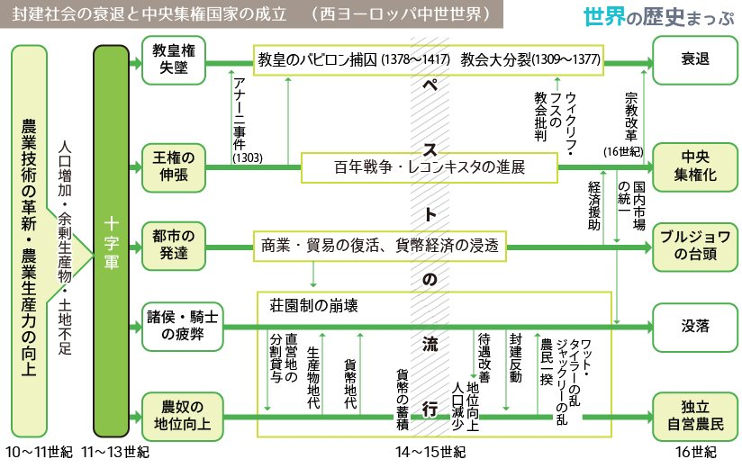

<!-- edit area -->

# 世界史 前記中間

<!--
<input type="button" id="play" value="read aloud"></input>
-->

目次を展開

- [世界史 前記中間](#世界史-前記中間)
  - [ギリシア人の都市国家](#ギリシア人の都市国家)
    - [ポリスの成立と発展](#ポリスの成立と発展)
    - [民主政への歩み](#民主政への歩み)
  - [ペリクレス将軍時代](#ペリクレス将軍時代)
    - [ポリス社会の変容](#ポリス社会の変容)
    - [ヘレニズム時代（約300年間）](#ヘレニズム時代約300年間)
    - [ギリシアの生活と文化](#ギリシアの生活と文化)
  - [ローマと地中海支配](#ローマと地中海支配)
    - [ローマ共和政](#ローマ共和政)
    - [地中海征服とその影響](#地中海征服とその影響)
    - [内乱の1世紀](#内乱の1世紀)
    - [ローマ帝国　帝政前期](#ローマ帝国帝政前期)
    - [帝国の変容（3世紀の危機）](#帝国の変容3世紀の危機)
    - [西ローマ帝国の滅亡（476年）](#西ローマ帝国の滅亡476年)
    - [ローマの生活と文化](#ローマの生活と文化)
  - [ヨーロッパ世界の形成](#ヨーロッパ世界の形成)
    - [ヨーロッパの風土と人々](#ヨーロッパの風土と人々)
    - [ゲルマン人の移動とイスラーム勢力の侵入](#ゲルマン人の移動とイスラーム勢力の侵入)
    - [ビザンツ帝国（東ローマ帝国）の成立](#ビザンツ帝国東ローマ帝国の成立)
    - [フランク王国の発展](#フランク王国の発展)
    - [ローマ＝カトリック教会の成長](#ローマカトリック教会の成長)
    - [全盛期 カール大帝](#全盛期-カール大帝)
    - [分裂するフランク王国](#分裂するフランク王国)
    - [外部勢力の侵入とヨーロッパ世界](#外部勢力の侵入とヨーロッパ世界)
    - [封建社会の成立](#封建社会の成立)
  - [キリスト教の歴史](#キリスト教の歴史)
    - [キリスト教の成立](#キリスト教の成立)
    - [迫害から国教化へ](#迫害から国教化へ)
    - [教会の権威](#教会の権威)
    - [十字軍とその影響](#十字軍とその影響)
  - [西ヨーロッパ世界の変容](#西ヨーロッパ世界の変容)
  - [対策プリント](#対策プリント)
    - [古代ギリシアとローマに共通する民主化](#古代ギリシアとローマに共通する民主化)
  - [記述まとめ](#記述まとめ)
    - [ギリシア](#ギリシア)
    - [ローマ](#ローマ)
    - [東西ヨーロッパ世界](#東西ヨーロッパ世界)
    - [キリスト教](#キリスト教)
    - [西ヨーロッパ世界の変容](#西ヨーロッパ世界の変容-1)

## ギリシア人の都市国家

<ul class="info">
<li> オリエント文明 ↔ ギリシア人の社会の比較</li>
<li>後のヨーロッパ近代文明に与えた影響</li>
</ul>

### ポリスの成立と発展

前8世紀、有力貴族の指導で都市国家(アテネなど)を建設（貴族政）

**( ==アクロポリス== )** （城山）を中心に **( ==集住== )** （シノイキスモス）

独立した国家、**( ==分立== )** 状態　→　統一国家を形成せず

**( ==同一民族== )** の意識を保持　←　共通言語・神話共有・アルファベット・オリンピアの祭典

市民　…　貴族と平民　関係は **( ==平等== )**
* 貴族　…　富裕者、高価な武具・馬を所有する戦士
* 平民　…　商人・農業（オリーブ、ぶどう）※小麦はエジプトから買う

奴隷　…　人格を認められず売買の対象

ポリス→城壁で囲まれた市域と周囲の田園、市民の人間生活の基盤
市域↓
* **( ==アクロポリス== )** (城山) …　市域の中心にあり、砦と神域を兼ねる
* **( ==アゴラ== )** (広場) …　市場や集会の会場→公共生活の中心（役所、裁判所…）

発展→人口増加による土地不足 … 各地に多くの **( ==植民市== )** を建設
→　エジプト等沿岸地域との交易活動の活発化
→　富裕化し武具購入
→　**( ==重装歩兵== )** となる（主力軍隊へ）

  

### 民主政への歩み

<u>どのようにして貴族が平民の政治参加を道を進めたか（アテネの民主化）</u>
① **( ==ドラコン== )** …　法律の成文化→法による秩序の維持

② **( ==ソロン== )** の改革　（前5世紀初）
* 貴族と平民の調停者
* **( ==財産政治== )**  …　血統ではなく財産額で参政権（ **( ==4== )** 等級に分類）
* **( ==債務奴隷== )** の禁止 …　負債帳消し、借金市民の奴隷売買禁止

③ **( ==ペイシストラトス== )** の僭主政治（アテネ、クーデターで独裁支配）
* 中小農民の保護　…　平民層の力を充実させる（平民に良い政治）

④ **( ==クレイステネス== )** の大改革（アテネ）　…　民主制の基礎を確立
* 部族制改革　…　貴族の4部族制（血縁）の代表から10地域（デーモス）の **( ==地縁共同体== )** 代表へ
* **( ==陶片追放== )** …　僭主の出現を予防：市民が陶片（オストラコン）で投票
→　6000票以上集まると、最多得票者を10年国外追放

<u>なぜ貴族政にかわって民主政が発達し、ペルシア戦争で民主化が完成したのか</u>
騎馬を利用する貴族にかわり、平民の重装歩兵部隊が軍隊の主力になり、裕福な市民が参政権を得る。  
ペルシア戦争では軍艦の漕ぎ手として無産市民も勝利に貢献し、参政権を獲得したため民主政が完成した。

>貴族＝重装騎兵　→　国防に貢献する人が政治に参加
>
>オリエントは小麦が穫れる　→　統一国家
>ギリシアは農業に不向き＝商業・交易中心　→　都市国家

  

## ペリクレス将軍時代

ペルシア戦争後の **( ==ペリクレス== )** 将軍時代 ＝ アテネ民主政治の完成期

* **( ==民会== )** …　成年男性（18歳以上）市民の全体集会→**多数決**で国家の制作を決定
* 行政　…　一般市民から **( ==抽選== )** で役人を選出（任期1年）（将軍など除く）
* 貧富に関わらず平等な参政権 → 多くの一般市民が政治に参加
* 世界史的意義 → 民主主義という考え方を世界で初めて生み出す

<u>古代のアテネ民主政の特徴と現代の民主主義の違い</u>
古代アテネは、直接民主制であり、女性・奴隷・在留外人に参政権がなく、奴隷制度に立脚している。

  

### ポリス社会の変容

<u>ギリシアの諸ポリスはなぜマケドニアに破れたのか</u>

ポリス社会の変容 … 戦乱・疫病 → 市民の人口減少、貧富の差拡大
→　ペルシア戦争で負けたペルシアの工作・陰謀？

**( ==マケドニア== )** の台頭　…　ポリスではなく王国を作る北方のギリシア人一派
→　北方では小麦がとれるので王国化

マケドニア国王 **( ==フィリッポス2世== )** による軍事力強化
→　前338年、カイロネイアの戦い　…　デーべ・アテネ連合軍を破る
→　スパルタ以外の全ギリシアのポリスを支配下に　…　**( ==コリントス同盟== )** (ヘラス同盟)

フィリッポス2世の暗殺後、息子の **( ==アレクサンドロス大王== )** がオリエント世界へ進出
→　各地に**アレクサンドリア**（ギリシア風都市）を建設　70ヵ所以上
→　東方遠征以降300年間 **( ==ヘレニズム時代== )**

  

### ヘレニズム時代（約300年間）

<u>ヘレニズム時代の世界史的な意義はなにか</u>
**( ==ギリシア== )** 文化の都市文明が帝国内に拡大したこと

  

### ギリシアの生活と文化

ギリシア文化の特色　…　明るく **( ==合理的で人間中心的== )** な文化、市民が対等に **( ==議論== )** するポリスの精神風土

ギリシア人の宗教　…　**( ==オリンポス12神== )** など多神教を信仰→神々は人間と同じ姿や感情を持つ

**( ==ソフィスト== )** (弁論教師) …　弁論の重要性が高まる←ペリクレスの死後アテネ衰退期
→　代表者 **( ==プロタゴラス== )** …　「万物の尺度は人間」

哲学（フィロソフィア）の3大哲学者の誕生
* **( ==ソクラテス== )** …　真理の絶対性、哲学（フィロソフィア）創始
* **( ==プラトン== )** …　イデア論、理想国家論
* **( ==アリストテレス== )** …　経験と観察を重視（現実世界）、あらゆる方面に思索
→　「万学の祖」と呼ばれる学問体系 → イスラームの学問、中世ヨーロッパのスコラ学に影響

**( ==ヘレニズム文化== )** の特色　…　東方各地域の文化から影響を受けた独自のギリシア文化
* **( ==世界市民主義== )**（コスモポリタニズム） …　ポリスの枠にとらわれない生き方を理想とする
* **( ==コイネー== )** と呼ばれるギリシア語が共通語へ

自然科学の発達

* 王立研究所 **( ==ムセイオン== )** …　エジプトのアレクサンドリアに創設
→自然科学・人文科学の研究
* **( ==エウクレイデス== )** …　平面幾何学「ユークリッド幾何学」の集大成
* **( ==アルキメデス== )** …　数学・物理学の諸原理を発見
* エラトステネス　…　地球の円周を計測

 

<u>ギリシア文明が近代ヨーロッパにもたらした影響は何だろうか</u>
ギリシア文明の合理的で人間中心的な文化はルネサンス以降のヨーロッパ近代文明の模範とされた

<u>オリエント文明と比べて、ギリシア人の社会にはどのような特徴があったのか。 また、それがのちのヨーロッパ近代文明に与えた影響は何だろうか。</u>
王が支配するオリエント諸国とは異なり、ギリシア社会は対等な市民からなるポリスを基盤としていた。
 
その合理的で人間中心的な文化は、民主主義という仕組みとともに近代ヨーロッパ文明の形成に大きな役割を果たした。

  

## ローマと地中海支配

ローマが全地中海世界を統一できたのはなぜか 
また、ローマ人がその後の世界に残した文化的遺産は何だろうか

### ローマ共和政

ローマの起源→前6世紀末、王を追放して貴族による **( ==共和政== )**（ギリシアの200年後）

身分差の存在　…　貴族 **( ==パトリキ== )** と中小農民の平民 **( ==プレブス== )** → 平等でない

* 貴族の **( ==コンスル== )**（執政官）… 2名の最高官職（任期1年）
* **( ==元老院== )**　 …　貴族の会議、実質的な支配権

中小農民　…　重装歩兵として台頭、国防を担う
→　平民の政治参加要求 → **( ==身分闘争== )** の開始＝民主化のプロセス
* **( ==護民官== )** 設置　…　平民出身、元老院・コンスルの決定に拒否権を行使できる
* **( ==平民会== )** 設置　…　平民だけの民会（元老院に合流できず）
* **( ==十二表法== )** 制定　…　慣習法（貴族が独占）を成文化

前367年 **( ==リキニウス・セクスティウス法== )** …　コンスルの1人は平民から選出

前 **( ==287== )** 年 **( ==ホルテンシウス法== )** …　平民会の決議が元老院の許可なしに国法となる
→　平民と貴族の政治上の権利が同等に（ **( ==民主政== )** 成立）

ギリシア民主政との違い
⇊
①貴族と富裕な平民による、**2つの議会が併存**
②非常時には、**( ==独裁官== )**（半年）を選出、独裁権を行使

<u>ローマ共和政は、ギリシアの共和政とどのような点で異なっていたのだろうか</u>
ギリシアは議会が1つだったが、ローマには元老院と平民会があり、非常時には臨時の独裁官が置かれた。
 
また、ローマには身分差があり、領土拡大を行っていた。

  

### 地中海征服とその影響

民主化と同時に領土拡大が進行。　重装歩兵（平民）が活躍

前282年　イタリア半島の統一
→　**( ==分割統治== )** …　征服された諸都市と個別に同盟を締結、異なる権利と義務を付与
→　団結・反乱を予防

前146年　西地中海支配　…　**( ==ポエニ戦争== )** でカルタゴに勝利
→　東地中海支配にも進出　…　前2世紀半ば、マケドニア、ギリシア諸ポリスを支配
→　地中海全体をほぼ制覇、イタリア半島以外にローマの支配地 **( ==属州== )** を拡大した

長期の征服戦争によるローマ社会の変化
1. 中小農民（平民）の没落・貧民化　…　重装歩兵として従軍→農地は荒廃
→ **( ==無産市民== )** としてローマへ流入→ローマ支配の恩恵で生活、さらなる制服戦争を望む
2. 元老院議員（貴族）…　属州統治の任務→属州の拡大で富裕化
3. 騎士（平民の一部）…　属州の徴税請負として富裕化（イタリア本土や征服地を買い占め）
→　戦争捕虜の奴隷を使役した **( ==大土地所有制== )**（ラティフンディア）による大規模な農業経営

征服戦争の拡大　…　貧富双方の市民に望まれ、経済的格差の著しい拡大を生む（市民の平等原則喪失へ）
→　共和政の土台が揺らぐ

<u>地中海における領土拡大は、ローマ共和政にどのような影響を与えたのだろうか</u>
国防の主戦力である中小農民の没落や経済格差の拡大をもたらし、ローマ社会が変質していった。

  

### 内乱の1世紀

平等原則の共和政から独裁制への過渡期、有力政治家同士の100年間の抗争時代

軍隊　…　中小農民の重装歩兵　⇒　有力者が集めた無産市民による傭兵（ローマ市民兵　⇒　私兵）

カエサル →　連続して独裁官に就任、元老院を無視→暗殺

内乱の終結 →　勝利者 **( ==オクタウィアヌス== )**（カエサルの養子）の独裁へ
→　父カエサルの失敗に学ぶ
→　「市民の中の第一人者」（プリンケプス）を自称、元老院など共和政の制度を尊重
→　帝政時代の開始（実際には全政治権力をもつ皇帝独裁）

  

### ローマ帝国　帝政前期

**( ==元首政== )**（プリンキパトゥス）…　事実上の皇帝独裁

オクタウィアヌス → 元老院から **( ==アウグストゥス== )**（尊厳者）の称号を贈与される

「ローマの平和」（パクス＝ロマーナ）→　アウグストゥス帝即位から約200年間
↓
**( ==五賢帝== )** 時代　…　ローマ最盛期の5皇帝
1. **( ==ネルウァ== )**
2. **( ==トラヤヌス== )**　→　領土最大
3. **( ==ハドリアヌス== )**
4. **( ==アントニヌス＝ピウス== )**
5. **( ==マルクス＝アウレリウス＝アントニヌス== )**

ローマ風都市の建設　…　ロンドン・パリ・ウィーン　→　後に近代都市に発展

ローマの属州統治 … 都市を通して支配
→　都市の上層市民→ **( ==ローマ市民権== )** を受け帝国支配に協力

212年 **( ==カラカラ帝== )** …　帝国の全自由人にローマ市民権を付与

商業活動の反映　→　中国・東南アジア・南アジアから絹や香辛料

<u>「ローマの平和」は、地中海世界にどのような影響を与えたのだろうか</u>
帝国支配の安定は、 
①経済活動の興隆をもたらし、 
②ローマ風の都市が各地に建設され、 
③アジアとの交易も盛んに行われた。 
また、 
④ローマ市民権の拡大が進み、都市の上層市民は納税により市民として帝国支配に貢献した。

  

### 帝国の変容（3世紀の危機）

各属州の軍団が独自に皇帝を擁立し元老院と争う　→　短期間で多数の皇帝が即位 **( ==軍人皇帝== )**

帝国内　…　経済の不振が表面化
帝国外　…　北方のゲルマン人・東方のササン朝→国境に侵入（東部）
⇒　分裂の危機

対策　…　都市市民への重税
⇒　上層市民が都市を去り田園で大所領の農業経営者に変化　→　都市衰退

労働力　…　**( ==コロヌス== )**　貧困化して都市から逃亡した下層市民などの小作人
→　**( ==コロナトゥス== )**（小作制）の普及 →　ラティフンディア（奴隷制）から変化

<u>ローマ帝国が危機を迎えた原因はなにか</u>
帝国内の財政難と、国外の異民族であるゲルマン人やペルシア人が西部国境沿いに侵入した軍事的困難が重なった。

  

### 西ローマ帝国の滅亡（476年）

帝政後期＝ **( ==専制君主政== )** の成立　…　皇帝の神格化→神として礼拝させる
1. **( ==ディオクレティアヌス帝== )** …　**( ==四帝分治制== )**（テトラルキア）
→　東西それぞれ正帝・副帝で統治（計4人）　→　混乱を沈静化
2. **( ==コンスタンティヌス帝== )** の改革　…　4分割から再統一、**( ==官僚体制== )** 構築→ **( ==中央集権== )** 体制
    * キリスト教の公認
    * 軍隊のさらなる増強
    * コロヌスを土地に拘束（税収確保のため）→ 下層民の身分・職業を **( ==世襲化== )**
    * ビザンティウムに親首都建設（330年）　→　**( ==コンスタンティノープル== )**

帝国の分裂と滅亡
* 国内　…　膨大な数の軍隊・官僚を支えるための重税　→　属州の反乱相次ぐ
* 国外　…　**( ==ゲルマン人の大移動== )** 開始（375年〜）

帝国の分裂 …　**( ==テオドシウス帝== )** 、帝国を東西に分割して2子に分与（395年）
* **( ==東ローマ帝国== )**（ビザンツ帝国）…　首都コンスタンティノープル→1453年まで存続
* **( ==西ローマ帝国== )**（ローマ中心）…　ゲルマン人の侵入で混乱
→　ゲルマン人傭兵隊長オドアケルが西ローマ皇帝を退位させる
→　西ローマ帝国滅亡　→　**( ==476== )** 年

西ローマ帝国の滅亡　＝　古代終了 **( ==476== )** 年　→　中世へ

<u>西ローマ帝国はなぜ滅んだのか</u>
ローマ帝国の中枢部分が東側に移り、ゲルマン人の移動が領内に集中したため、社会が混乱していった。

  

### ローマの生活と文化

特色
* **( ==実用的文化== )** に能力発揮　…　ギリシアから学んだ知識を帝国支配に応用（土木・法律）
* 精神文化　…　ギリシア人の独創性を超えられず（ローマはギリシア人を尊敬）

ローマ帝国の文化的意義 …　支配を通して地中海世界のすみずみにギリシア・ローマの文化を普及
* ローマ字　…　ヨーロッパの大多数の言語で使用
* **( ==ラテン語== )** …　近代に至るまで協会・学術の国際的な公用語
* ギリシア・ローマの文化遺産　→　近世・近代のヨーロッパ人が古典として尊重

<u>ローマ人が残した文化的遺産にはどのようなものがあるか</u>
支配に応用する実用文化に優れ、土木・建築技術やローマ法、ラテン語などが後世に大きな影響を与えた。

<u>ローマが全地中海世界を統一できたのはなぜだろうか</u>
強大な軍事力に加え、①分割統治、②ローマ市民権の付与、といった巧妙な政策を進め、領域内の市民が帝国支配に貢献したから。

  

## ヨーロッパ世界の形成

東西ヨーロッパは、どのようにして独自の世界を形づくっていったのだろうか

### ヨーロッパの風土と人々

ヨーロッパの範囲　…　**( ==ウラル山脈== )** 〜 大西洋

東⇒西、北⇒南　→　人間は絶えず **( ==温暖== )** な気候に向けて移動する

西ヨーロッパと東ヨーロッパ　→　エルベ川が境界

  

### ゲルマン人の移動とイスラーム勢力の侵入

**( ==ゲルマン人== )** の勢力拡大　…　現住地の **( ==バルト海沿岸== )** →西へ
→　紀元前後頃にはローマ国境と接する

原始ゲルマンの社会　…　重要な決定は **( ==民会== )**（成年男性自由人の全体集会）で実施

ローマ帝政後期
* 大移動の内的要因 … 人口増加による耕地不足→平和的に移住（下級官吏、傭兵、コロヌス）
* 大移動の外的要因 … アジア系の **( ==フン人== )** が4世紀後半にゲルマン人の居住区を圧迫
→　西ゴート人が圧迫されローマ帝国内へ移住→**200年**に及ぶ **( ==ゲルマン人の大移動== )** の開始（376年）
→　ゲルマン人はイタリアに集中して移動

傭兵隊長 **( ==オドアケル== )** が西ローマ帝国を滅ぼし、王国建国
↓
東ゴート人が倒し、**( ==東ゴート王国== )** 建国
↓
568年 **( ==ランゴバルド王国== )** 建国
↓
民族大移動は一応終息

711年、イスラーム勢力は西ゴート王国を滅ぼす　…　イベリア半島を支配

<u>なぜゲルマン人とイスラーム勢力は地中海世界に侵入したのだろうか</u>
人口増加による農地不足によるローマ帝国への平和的移住と、フン人によるゲルマン人への圧迫があり、大移動となる。 
（イスラーム勢力は布教活動の目的地として地中海経由での北上侵略が実施された）
 
ゲルマン人もイスラーム勢力もローマ帝国時代の経済的繁栄への魅力があり、侵入があった。

  

### ビザンツ帝国（東ローマ帝国）の成立

**( ==ビザンツ帝国== )** の成立　…　ラテン語からギリシア語に公用語を変えて国名もギリシア化する（皇帝の奥さんがギリシア人）
* 独自の文化　…　**( ==ギリシア正教== )** と **( ==ギリシア古典文化== )** が融合
* 経済面　…　ゲルマン人の大移動によっても深刻な打撃は受けず
→　首都 **( ==コンスタンティノープル== )** の繁栄（貿易都市）
* 政治面　…　ローマ帝政末期以来の巨大な官僚制による皇帝専制支配を維持
→　皇帝がコンスタンティノープル協会を支配→ **( ==政教両面== )** における最高の権力者

ビザンツ帝国の最盛期　…　**( ==ユスティニアヌス大帝== )** の時代
→　**( ==地中海沿岸部== )** をほぼローマ帝国領として復活させた

<u>西ヨーロッパが混乱していた一方で、ビザンツ帝国はなぜ繁栄を続けたのか</u>
ゲルマン人の大移動によっても、①深刻な打撃は受けず、②商業・貨幣経済の繁栄を継続したから。

  

### フランク王国の発展

**( ==5== )** 世紀　〜　**( ==9== )** 世紀（870年に3分裂）

481年　…　**( ==クローヴィス== )** がフランク王に即位し、**( ==メロヴィング朝== )** を開く
→　**( ==ガリア== )**（現在のフランス）中部支配確立

当時、多くのゲルマン人は異端のアリウス派のキリスト教を信仰
→　クローヴィスは **( ==アタナシウス派== )**（イエス＝神）に改宗
→　**( ==ローマの貴族層== )** を支配層に取り込む→西ヨーロッパの中心勢力へ

8世紀、メロヴィング朝の権力衰退　→　**( ==宮宰== )**（行政、財政の長官）が実権を掌握

西ゴート王国を滅ぼしたイスラーム勢力　…　ピレネー山脈を超えてガリアへ侵攻
→　メロヴィング朝の宮宰 **( ==カール・マルテル== )** が　 **( ==トゥール・ポワティエ間の戦い== )** で撃退（732年）
→　西方キリスト教世界を外部勢力（イスラム教）から守る→ローマ教皇喜ぶ

751年 **( ==カロリング朝== )** の成立　…　カール・マルテルの子 **( ==ピピン== )** がメロヴィング朝を廃して創始

西ヨーロッパ　→　フランク王国を中心に独自の世界を形成

  

### ローマ＝カトリック教会の成長

<u>なぜローマ教会はフランク王国と手を組んだのだろうか</u>

ローマ帝政末期　…　五本山のうち、ローマ教会とコンスタンティノープル教会が最有力
→　西ローマ滅亡後、ローマ教会はコンスタンティノープル教会（ビザンツ皇帝支配）から分離傾向

ローマ司教　…　使徒ペテロの後継者を自任　→　**( ==教皇== )**（法王）として権威を高める

726年　ビザンツ皇帝 **( ==レオ3世== )** が **( ==聖像禁止令== )** を発布
→　ローマ教会が反発　…　ゲルマン人への布教に聖像を必要とするため
→　東西の両教会の対立と分裂強まる

>西方教会　→　ローマ=カトリック教会
>東方教会　→　ギリシア正教（コンスタンティノープル教会中心）

ローマ教会　…　ビザンツ皇帝に対抗できる政治勢力を求め、フランク王国に接近
→　カール＝マルテルがイスラーム軍を破って西方キリスト教世界を守る（トゥール・ポワティエ間の戦い）

ローマ教皇が **( ==ピピン== )**（カール＝マルテルの子）のフランク王位継承を承認
→　ピピンはメロヴィング朝の宮宰だったが王を追放してカロリング朝を創始
→　返礼にピピンはイタリアの **( ==ラヴェンナ地方== )**（ランゴバルド王国から奪う）を教皇に寄進（ピピンの寄進）
→　**( ==教皇領== )** の始まり

<u>なぜローマ教会はフランク王国と手を組んだのだろうか</u>
ビザンツ皇帝の聖像禁止令に反発したローマ教皇は、強力な政治勢力を保護者として求めたから。

  

### 全盛期 カール大帝

**( ==カール大帝== )**（ピピンの子）…　西ヨーロッパの主要部分統一　→　ビザンツ帝国に並ぶ強大国化
→　ランゴバルド王国征服、イスラーム勢力撃退など

中央集権的支配　…　全国を州に分割し、**( ==伯== )**（各州の長官）として地方有力豪族を任命
→　**( ==巡察使== )** を派遣して伯を監督させた

ラテン語による文芸復興 **( ==カロリング・ルネサンス== )**　…　宮廷に **( ==アルクイン== )** らの学者を多数招く
→　アルファベットの小文字の発明、写本文化の隆盛

**( ==カールの戴冠== )** …　**( ==800== )** 年、教皇 **( ==レオ3世== )** がカールに **( ==ローマ皇帝== )** の帝冠を付与
→　ローマ教会　…　カールをビザンツ皇帝に対抗しうる政治的保護者と認める
→　**( ==西ローマ帝国== )** の復活を宣言

歴史的意義　・　西ヨーロッパ世界が **( ==政治== )**・**( ==文化== )**・**( ==宗教== )** 的にビザンツ皇帝から独立
→　**( ==西ヨーロッパ中世世界== )** の誕生　…　**( ==ローマ文化== )**・**( ==キリスト教== )**・**( ==ゲルマン人== )** が融合

>ローマ文化　→　アルクイン
>キリスト教　→　レオ3世
>ゲルマン人　→　カール大帝　など

1054年　東西教会の完全分裂
* 教皇を首相とするローマ＝カトリック教会（西）
* ビザンツ皇帝を首長とするギリシア正教会（東）
→　コンスタンティノープル総主教（ギリシア正教）とローマ教皇が破門しあった

<u>カールの戴冠は、世界の歴史においてどのような意義を持つのだろうか</u>
「西ローマ帝国」の復活により、ビザンツ皇帝からの独立と、ローマ文化・キリスト教・ゲルマン人が融合する西ヨーロッパ中世世界の誕生を意味する。

  

### 分裂するフランク王国

カールの帝国は、カールと伯の個人的な結びつきの上に成り立つ
→　カールの死後、 **( ==東フランク== )**（ドイツ）、 **( ==西フランク== )**（フランス）、 **( ==イタリア== )** に分裂
→　**( ==9== )** 世紀（カールの戴冠の70年後）

**( ==東フランク== )**（ドイツ）…　カロリング家の血筋断絶　→　**( ==ドイツ王国== )** へ
* 諸侯の選挙で王を選出
* **( ==オットー1世== )** …　異民族の侵入を撃退し、北イタリアを制圧
→　教皇からローマ皇帝の位を与えられる　→　**( ==神聖ローマ帝国== )** に改称
→　**( ==10== )** 世紀
→　カール大帝に代わる政治・軍事的庇護者としてオットー1世を評価した
* **( ==イタリア政策== )**　…　10〜13世紀、神聖ローマ皇帝がイタリア北部の都市やシチリアの支配に積極的に乗り出した

**( ==西フランク== )**（フランス）…　カロリング家の血筋断絶
→　初代国王パリ伯 **( ==ユーグ・カペー== )** が王位について **( ==カペー朝== )** **フランス王国** へ …　王権弱体、パリ周辺の支配のみ

**( ==イタリア== )** …　カロリング家の血筋断絶　→　混乱継続
→　その後、北方からの神聖ローマ帝国の介入、地中海方面からのイスラーム勢力の侵入　→　混乱継続

<u>カール大帝後のフランク王国の各地域は、どのような状況だったのだろうか</u>
帝国は東・西フランクとイタリアの3つに分裂し、それぞれ分権的な性格が強かった。

  

### 外部勢力の侵入とヨーロッパ世界

**( ==ノルマン人== )** …　スカンディナヴィア半島やユトランド半島にすむゲルマン人の一派
→　西欧を侵略・征服国家樹立（ヴァイキング、商業・海賊）

デンマーク・スェーデン・ノルウェーなど北欧諸王国　…　**キリスト教化**、ノルマン人の移動終わり西欧世界の一部へ

<u>ノルマン人が西ヨーロッパ世界において果たした歴史的役割はなにか</u>
西ヨーロッパを脅かした代表的な外部勢力として、ヨーロッパ各地に海上遠征をおこなって征服国家を建てた。
 
これは西ヨーロッパを中心に防衛のための封建社会が形成される大きな要因となった。

  

### 封建社会の成立

**( ==封建社会== )** …　11〜12世紀、**( ==封建的主従関係== )**・**( ==荘園== )** を基盤に成立
→　西ヨーロッパ中世世界の基本的な骨組みとなる
→　成立の背景となった社会変化
* 商業・都市の衰退　→　**( ==農業== )**・**( ==土地== )** に依存する社会へ
* 支配者層　…　外部勢力の侵入から生命・財産を守るため、弱者は強者に保護を求める

封建的主従関係 →　主君が **( ==封土== )**（領地）を与えて保護、家臣は忠誠、軍役の義務
* 主君と家臣の双方に契約を守る義務　→　**( ==双務的契約関係== )**
* 一人で複数の主君を持てる
* フランク王国分裂以後、ノルマン人など外部勢力の侵入から地域社会を守るため本格化

荘園　…　農民を支配する領主（封土を受けた支配者層）の個々の所有地
→　手工業者も居住、自給自足的な **( ==現物経済== )** が支配的

**( ==農奴== )**　…　ローマ帝政末期のコロヌスや没落したゲルマンの自由農民の子孫
領主への義務
* **( ==賦役== )** …　領主直営地での労働
* **( ==貢納== )** …　自己保有地からの生産物の納入

領主の特権
* 荘園と農民を自由に支配
* **( ==領主裁判権== )** によって農民を裁く
* **( ==不輸不入権== )**（インムニテート） …　国王役人の荘園への立ち入りや課税を拒否

<u>西ヨーロッパに特有の封建社会の仕組みとは、どのようなものか</u>
領土を持つ支配者間での封建的主従関係と、この関係を取り結んだ領主が農民を支配する荘園という2つの仕組みの上に成り立っていた。

<u>東西ヨーロッパは、どのようにして独自の世界を形づくっていったのか</u>
①国家としてはフランク王国とビザンツ帝国、 
②宗教的にはローマ教会とギリシア正教、 
③言語・文化的にはラテンとギリシア、 
という、東西それぞれ異なる国家・社会・文化の基盤を形成した。

  

## キリスト教の歴史

キリスト教が当時のローマ帝国に急速に広がった原因は何だろうか。 
また、ローマ帝国はキリスト教をどのように利用したのだろうか。

### キリスト教の成立

キリスト（ギリシア語）＝ メシア（救世主、ヘブライ語） ＝　神から特別に祝福された者

イエスの主張　…　貧富の区別なく及ぼされる神（ヤハウェ）の **( ==絶対愛== )** と **( ==隣人愛== )** を説く
→　祭司・パリサイ派を批判
→　ローマに対する反逆者として提督ピラトに訴えられる
→　十字架による処刑

キリスト教の成立　…　弟子たち **( ==使徒== )** は、3日後のイエスの復活と、その死は人間の罪を贖う行為であったと信じる
→　使徒 **( ==ペテロ==  )**・**( ==パウロ== )** の伝道活動へ
→　ローマ帝国各地に布教し拡大

**( ==パウロ== )**　→　神の愛は **( ==異邦人== )**（ユダヤ人以外）にも及ぶと主張　＝　世界宗教の基盤成立

**( ==教会== )**（信徒の団体）の成立　…　アナトリア・シリア・ギリシア・首都ローマ創設
→　3世紀頃までに、奴隷・女性・下層市民などの社会的弱者を中心に広まる
→　やがて上層市民にも普及

**( ==新約聖書== )**　…　共通ギリシア語 **( ==コイネー== )** で記録、キリスト教の教典

<u>イエスが処刑された理由は何だろうか</u>
イエスの主張する神の愛と隣人愛を、ユダヤ教の祭司や律法学者（パリサイ派）は危険な考えとみなしたから。

  

### 迫害から国教化へ

迫害の理由　…　唯一絶対神を信じるキリスト教徒　→　国家祭儀・**( ==皇帝礼拝== )** を拒否したため
* 64年　ネロ帝の迫害
* 303年　ディオクレティアヌス帝の大迫害

313年 **( ==コンスタンティヌス帝== )** が **( ==ミラノ勅令== )** でキリスト教公認
→　ローマ帝国の統一維持のため利用
→　**( ==ニケーア公会議== )** を主催し、**( ==アタナシウス派== )** を正統教義とする
→　後に **( ==三位一体説== )**（神＝キリスト＝精霊）として確立

**( ==アリウス派== )**（キリスト＝人間）　→　異端、ゲルマン人に布教

**( ==教父== )**（キリスト教思想家）…　正統教義の確立、のちの神学の発展に貢献
→　**( ==アウグスティヌス== )** …　『神の国』でキリスト教の神の国が永遠であると主張

392年 **( ==テオドシウス帝== )** …　アタナシウス派キリスト教を国教として他宗教厳禁
→　教会の組織化が進展（司教・司祭などの聖職者身分が成立）

ローマ帝国末期　…　**( ==五本山== )**（5つの教会）が中心となり信者を指導
* ローマ
* コンスタンティノープル
* アンティオキア
* イェルサレム
* アレクサンドリア

  

### 教会の権威

**( ==ローマ・カトリック教会== )** …　西ヨーロッパ世界全体に普遍的権威を及ぼす
→　**( ==階層制組織== )** …　聖職者の序列を定めるピラミッド型の組織

教会・聖職者の世俗化（富裕化） …　荘園をもつ大領主へ
→　すべての荘園の農民から **( ==十分の一税== )** を徴収
→　聖職者が聖職売買により出世を求める弊害が起こる

教会の改革運動　… **( ==クリュニー修道院== )** →　フランス中東部で10世紀以降に改革運動
→　教皇 **( ==グレゴリウス7世== )** …　聖職売買や聖職者の妻帯を禁止、聖職叙任権の奪取も画策
→　**( ==叙任権闘争== )** …　ドイツ国王 **( ==ハインリヒ4世== )** と対立
→　**( ==カノッサの屈辱== )** …　教皇が改革を無視する国王を破門→ハインリヒ4世謝罪

>ハインリヒ4世はグレゴリウス7世を訪ね、雪の中3日3晩立ち続けた
>破門が解かれた5年後、ドイツ軍を派遣してグレゴリウス7世をローマに幽閉した

教皇の指導権確立
* **( ==ヴォルムス協約== )**　…　教皇と皇帝が妥協し、叙任権闘争が終結
* 13世紀、教皇権の絶頂　→　**( ==インノケンティウス3世== )** の時代
    * ドイツのオットー4世、フランスのフィリップ2世、イギリス王ジョン、第4回十字軍を破門
    * 「教皇は太陽、皇帝は月」と言った

<u>中世の西ヨーロッパでは、なぜローマ・カトリック教会が普遍的な権威をふるったのか</u>
①キリスト教の信仰がすべての身分に浸透していたことに加え、 
②各地の王権が弱小で統一的権力になれなかったのに対し、 
③教会は階層制組織を整備して西ヨーロッパ全体に影響を及ぼしたから。

  

### 十字軍とその影響

背景　…　西ヨーロッパ封建社会の安定と成長　→　人口が飛躍的に増大
* **( ==温暖== )** な気候
* **( ==三圃制== )** の普及、犂・水車の改良など農業技術の進歩

西ヨーロッパの拡大
* 修道院を中心とする開墾運動
* オランダの干拓
* エルベ川以東への植民
* イベリア半島の国土回復運動
* 巡礼の流行
→　最大規模のものが十字軍

十字軍提唱　…　教皇 **( ==ウルバヌス2世== )** が 1095年、**( ==クレルモン宗教会議== )** を招集し、聖地回復の聖戦を提唱
↑　セルジューク朝に脅かされたビザンツ皇帝の救援要請に応じる

聖戦の目的　…　聖地 **( ==イェルサレム== )** をイスラム世界から奪還するため
→　**( ==セルジューク朝== )** と戦う
→　イギリス・フランス・ドイツ（神聖ローマ帝国）の国王らに命令

結果　→　失敗（7回全部）

影響・意義　…　中世の西ヨーロッパ世界の転換点となる
* 宗教面　…　失敗により **( ==教皇権== )** がゆらぎ、宗教的情熱が冷める
* 政治面　…　諸侯や騎士が没落、遠征を指揮した **( ==国王== )** の権威が高まる
* 経済面　…　都市の発達、交通の発達、地中海で東方貿易が発達（イタリア）
* 文化面　…　ビザンツ帝国やイスラーム圏からの流入で西欧人の **( ==視野拡大== )**

<u>十字軍はその後の西ヨーロッパにどのような影響を与えたのだろうか</u>
遠征の失敗で、 
①教皇の権威は揺らぎはじめ、多くの 
②諸侯や騎士が没落した一方、 
③国王の権威は高まった。  
また、遠征軍の輸送で、 
④イタリア諸都市が繁栄し、東方との交流が活発化して東西間で交流が盛んになり、 
⑤西ヨーロッパ人の視野が拡大した。

<u>キリスト教が当時のローマ帝国に急速に広がった原因は何だろうか。 
また、ローマ帝国はキリスト教をどのように利用したのだろうか</u>
成立当初の信者層は社会的弱者であった。 
3世紀の危機以降、上層市民にまで信者層が広がり、帝国全土に拡大すると、4世紀には帝国の統一維持のためにコンスタンティヌス帝が弾圧から公認へ政策を転換し、テオドシウス帝期に国教化された。

重要なローマ教皇　※順番必須

| 教皇 | やったこと | 時代 |
| --- | --- | --- |
| **( ==レオ3世== )** | 800年にカールの戴冠、西ローマ帝国の復活宣言 | 8世紀 |
| **( ==グレゴリウス7世== )** | 教会改革、叙任権闘争→カノッサの屈辱 | 11世紀 |
| **( ==ウルバヌス2世== )** | クレルモン宗教会議→十字軍提唱 | 11世紀 |
| **( ==インノケンティウス3世== )** | 教皇権の絶頂（教皇は太陽、皇帝は月） | 12世紀 |
| **( ==ボニファティウス8世== )** | 聖職者への課税に反対→アナーニ事件で憤死 | 13世紀末 |

  

## 西ヨーロッパ世界の変容

 

1. 教皇権の失墜 …　**( ==アナーニ事件== )**　→　教皇 **( ==ボニファティウス8世== )** がフランス国王 **( ==フィリップ4世== )** に幽閉される
→　ローマからフランスの **( ==アヴィニョン== )** に教皇庁を移し、70年近く監視　**( ==教皇のバビロン捕囚== )**
→　幽閉の原因　…　国王が決定した **( ==聖職者への課税== )** に教皇が反発したため

2. 王権の伸張　…　経済的支援を都市の市民から受ける（市場を統一する政治権力を望んだ）
→　没落した諸侯・騎士を **( ==廷臣== )** として雇い、臣下とする　→　**( ==中央集権化== )**

3. 都市の発達　…　商業・貿易の復活、**貨幣経済**の浸透
→　市民は国王に接近し、**( ==国内市場の統一== )** を依頼　→　市場の独占販売権を狙う

4. 荘園制崩壊　…　自給自足経済から貨幣経済が荘園にも普及
    * 農奴の地位向上→独立自営農民 **( ==ヨーマン== )**（イギリス）
    * 領主（諸侯・騎士）の没落→地代収入では不足→国王の臣下へ

>＜イギリス＞
>ワット・タイラーの乱に勝利　→　農奴制廃止
>
>＜フランス＞
>ジャックリーの乱に敗北　→　農奴は残った

 

5. 諸侯・騎士没落　…　英仏 **( ==百年戦争== )** や内線が続き英仏の諸侯・騎士の没落は決定的となる
→ **( ==ドイツ== )** では大きな戦争もなく諸侯・騎士の勢力は衰えず

<u>封建社会の仕組みは、なぜ解体に向かったのか</u>
①貨幣経済の浸透で経済力を持つ農民が現れ、 
②黒死病の流行で農民の身分的束縛が改善されるなど、封建社会の中心であった 
③領主にとって苦しい状況となり、経済基盤である荘園制が崩れたから。

<u>百年戦争によって、イギリスとフランスはどうのように変容したのだろうか</u>
フランスでは、長い戦争を通じて諸侯・騎士が没落する一方、シャルル7世が大商人と結んで財政を立て直し、常備軍を設置したことから、中央集権化が急速に進展した。 
イギリスでは、戦後に王位継承の内乱が発生し、諸侯・騎士がフランス同様に没落した。この内乱を収めたヘンリ7世は、統治制度を整えて中央集権化を進めた。

<u>イギリスとフランスには身分制議会が成立している。 
どのような議題を話し合うために成立したのだろうか</u>
イギリスでは1295年に国王により模範議会（聖職者・貴族・州と都市の代表者）が招集された。
議題は法律の制定や進化税についてである。
 
フランスでは1302年に国王により三部会（聖職者・貴族・平民の代表者）が招集された。聖職者への課税について話し合うために成立した。
国王が課税への協力・承認を求めた。

  

---

## 対策プリント

 

### 古代ギリシアとローマに共通する民主化

貴族共和政から平民が政治参加を要求

<u>なぜ要求できるようになったのか</u>
平民である中小農民が経済力を高め、武器を揃えて **( ==重装歩兵== )** となった。
国防に貢献できる一員となったため政治参加の資格があると考えた。
ちなみに、貴族は馬に乗って戦う **( ==重装騎兵== )** である。

 

＜民主化の完成＞
アテネ　→　**( ==ペルシア戦争== )** 後
ローマ　→　**( ==ホルテンシウス法== )** の制定　**( ==287== )** 年

とちゅう

---

## 記述まとめ

 

### ギリシア

<u>なぜ貴族政にかわって民主政が発達し、ペルシア戦争で民主化が完成したのか</u>
騎馬を利用する貴族にかわり、平民の **( ==重装歩兵== )** 部隊が軍隊の主力になり、裕福な市民が **( ==参政権== )** を得る。
**( ==ペルシア戦争== )** では軍艦の漕ぎ手として **( ==無産市民== )** も勝利に貢献し、参政権を獲得したため **( ==民主政== )** が完成した。 

 

<u>古代のアテネ民主政の特徴と現代の民主主義の違い</u>
古代アテネは、**( ==直接民主制== )** であり、 **( ==女性== )**・**( ==奴隷== )**・在留外人に参政権がなく、**( ==奴隷制度== )** に立脚している。 

 

<u>ヘレニズム時代の世界史的な意義はなにか</u>
**( ==ギリシア== )** 文化の都市文明が帝国内に拡大したこと。

 

<u>オリエント文明と比べて、ギリシア人の社会にはどのような特徴があったのか。
また、それがのちのヨーロッパ近代文明に与えた影響は何だろうか。</u>
**( ==王== )** が支配するオリエント諸国とは異なり、ギリシア社会は **( ==対等== )** な市民からなる **( ==ポリス== )** を基盤としていた。
その **( ==合理的== )** で **( ==人間中心的== )** な文化は、**( ==民主主義== )** という仕組みとともに近代ヨーロッパ文明の形成に大きな役割を果たした。 

 

### ローマ

<u>ローマ共和政は、ギリシアの共和政とどのような点で異なっていたのだろうか</u>
ギリシアは議会が1つだったが、ローマには **( ==元老院== )** と **( ==平民会== )** があり、非常時には臨時の **( ==独裁官== )** が置かれた。
また、ローマには **( ==身分差== )** があり、**( ==領土拡大== )** を行っていた。 

 

<u>地中海における領土拡大は、ローマ共和政にどのような影響を与えたのだろうか</u>
国防の主戦力である **( ==中小農民== )** の没落や **( ==経済格差の拡大== )** をもたらし、ローマ社会が変質していった。 

 

<u>「ローマの平和」は、地中海世界にどのような影響を与えたのだろうか</u>
**( ==帝国支配== )** の安定は、
① **( ==経済活動== )** の興隆をもたらし、
② **( ==ローマ風の都市== )** が各地に建設され、
③ **( ==アジア== )** との交易も盛んに行われた。
また、
④ **( ==ローマ市民権== )** の拡大が進み、都市の上層市民は納税により市民として **( ==帝国支配に貢献== )** した。

 

<u>ローマ帝国が(3世紀の)危機を迎えた原因はなにか</u>
帝国内の **( ==財政難== )** と、国外の異民族である **( ==ゲルマン人== )** やペルシア人が西部国境沿いに侵入した **( ==軍事的困難== )** が重なった。 

 

<u>西ローマ帝国はなぜ滅んだのか</u>
ローマ帝国の **( ==中枢部分== )** が **( ==東側== )** に移り、**( ==ゲルマン人== )** の移動が領内に集中したため、社会が混乱していった。

 

<u>ローマ人が残した文化的遺産にはどのようなものがあるか</u>
支配に応用する **( ==実用文化== )** に優れ、**( ==土木== )**・**( ==建築== )** 技術や **( ==ローマ法== )**、**( ==ラテン語== )** などが後世に大きな影響を与えた。 

 

<u>ローマが全地中海世界を統一できたのはなぜだろうか</u>
強大な **( ==軍事力== )** に加え、
① **( ==分割統治== )** 、
② **( ==ローマ市民権== )** の付与、
といった巧妙な政策を進め、領域内の **( ==市民== )** が帝国支配に貢献したから。 

 

### 東西ヨーロッパ世界

<u>なぜゲルマン人とイスラーム勢力は地中海世界に侵入したのだろうか</u>
**( ==人口増加== )** による **( ==農地== )** 不足によるローマ帝国への平和的移住と、**( ==フン人== )** によるゲルマン人への圧迫があり、大移動となる。
イスラーム勢力は **( ==布教== )** 活動の目的地として地中海経由での北上侵略を実施した。
ゲルマン人もイスラーム勢力もローマ帝国時代の **( ==経済的繁栄== )** への魅力があり、侵入があった。 

 

<u>西ヨーロッパが混乱していた一方で、ビザンツ帝国はなぜ繁栄を続けたのか</u>
ゲルマン人の大移動によっても、
①深刻な打撃は受けず、
②首都コンスタンティノープルを中心に **( ==商業== )** と **( ==貨幣経済== )** の繁栄を継続したから。 

 

<u>なぜローマ教会はフランク王国と手を組んだのだろうか</u>
**( ==ビザンツ皇帝== )** の **( ==聖像禁止令== )** に反発したローマ教皇は、強力な **( ==政治勢力== )** を保護者として求めたから。 

 

<u>カールの戴冠は、世界の歴史においてどのような意義を持つのだろうか</u>
**( ==西ローマ帝国== )** の復活により、**( ==ビザンツ皇帝== )** からの独立と、**( ==ローマ文化== )**・**( ==キリスト教== )**・**( ==ゲルマン人== )** が融合する **( ==西ヨーロッパ中世世界== )** の誕生を意味する。

 

<u>カール大帝後のフランク王国の各地域は、どのような状況だったのだろうか</u>
帝国は **( ==東フランク== )**・**( ==西フランク== )**・**( ==イタリア== )** の3つに分裂し、それぞれ **( ==分権的== )** な性格が強かった。 

 

<u>ノルマン人が西ヨーロッパ世界において果たした歴史的役割はなにか</u>
西ヨーロッパを脅かした代表的な外部勢力として、ヨーロッパ各地に海上遠征をおこなって **( ==征服国家== )** を建てた。
これは西ヨーロッパを中心に **( ==防衛== )** のための **( ==封建社会== )** が形成される大きな要因となった。

 

<u>西ヨーロッパに特有の封建社会の仕組みとは、どのようなものか</u>
領土を持つ **( ==支配== )** 者間での **( ==封建的主従関係== )** と、この関係を取り結んだ領主が農民を支配する **( ==荘園== )** という2つの仕組みの上に成り立っていた。 

 

<u>東西ヨーロッパは、どのようにして独自の世界を形づくっていったのか</u>
①国家としては **( ==フランク王国== )** と **( ==ビザンツ帝国== )**、
②宗教的には **( ==ローマ教会== )** と **( ==ギリシア正教== )**、
③言語・文化的には **( ==ラテン== )** と **( ==ギリシア== )**、
という、東西それぞれ異なる **( ==国家== )**・**( ==社会== )**・**( ==文化== )** の基盤を形成した。

 

### キリスト教

<u>イエスが処刑された理由は何だろうか</u>
イエスの主張する **( ==神の愛== )** と **( ==隣人愛== )** を、**( ==ユダヤ教== )** の **( ==祭司== )** や律法学者 **( ==パリサイ派== )** は危険な考えとみなしたから。 

 

<u>中世の西ヨーロッパでは、なぜローマ・カトリック教会が普遍的な権威をふるったのか</u>
①キリスト教の信仰が **( ==すべての身分== )** に浸透していたことに加え、
②各地の **( ==王権== )** が弱小で **( ==統一的権力== )** になれなかったのに対し、
③教会は **( ==階層制組織== )** を整備して西ヨーロッパ全体に影響を及ぼしたから。 

 

<u>十字軍はその後の西ヨーロッパにどのような影響を与えたのだろうか</u>
遠征の失敗で、
① **( ==教皇== )** の権威は揺らぎはじめ、多くの
② **( ==諸侯== )** や **( ==騎士== )** が没落した一方、
③遠征を指揮した **( ==国王== )** の権威は高まった。

また、遠征軍の **( ==輸送== )** で、
④ **( ==イタリア== )** 諸都市が繁栄し、**( ==東方== )** との交流が活発化して東西間で交流が盛んになり、
⑤西ヨーロッパ人の **( ==視野== )** が拡大した。

 

<u>キリスト教が当時のローマ帝国に急速に広がった原因は何だろうか。
また、ローマ帝国はキリスト教をどのように利用したのだろうか</u>
成立当初の信者層は **( ==社会的弱者== )** であった。
**( ==3世紀の危機== )** 以降、上層市民にまで信者層が広がり、帝国全土に拡大すると、4世紀には帝国の **( ==統一維持== )** のために **( ==コンスタンティヌス帝== )** が弾圧から公認へ政策を転換し、**( ==テオドシウス帝== )** 期に **( ==国教化== )** された。 

 

### 西ヨーロッパ世界の変容

<u>封建社会の仕組みは、なぜ解体に向かったのか</u>
① **( ==貨幣経済== )** の浸透で **( ==経済力== )** を持つ農民が現れ、
② **( ==黒死病== )** の流行で農民の **( ==身分的束縛== )** が改善されるなど、封建社会の中心であった
③ **( ==領主== )** にとって苦しい状況となり、経済基盤である **( ==荘園制== )** が崩れたから。 

 

<u>百年戦争によって、イギリスとフランスはどうのように変容したのだろうか</u>
フランスでは、長い戦争を通じて **( ==諸侯== )**・**( ==騎士== )** が没落する一方、**( ==シャルル7世== )** が大商人と結んで財政を立て直し、**( ==常備軍== )** を設置したことから、**( ==中央集権化== )** が急速に進展した。
イギリスでは、戦後に **( ==王位継承== )** の内乱が発生し、諸侯・騎士がフランス同様に没落した。この内乱を収めた **( ==ヘンリ7世== )** は、**( ==統治制度== )** を整えて **( ==中央集権化== )** を進めた。

 

<u>イギリスとフランスには身分制議会が成立している。
どのような議題を話し合うために成立したのだろうか</u>
イギリスでは1295年に国王により **( ==模範議会== )**（聖職者・貴族・州と都市の代表者）が招集された。 議題は **( ==法律== )** の制定や **( ==新課税== )** についてである。
フランスでは1302年に国王により **( ==三部会== )**（聖職者・貴族・平民の代表者）が招集された。 **( ==聖職者への課税== )** について話し合うために成立した。 国王が課税への協力・承認を求めた。 

 

<!-- edit area -->

  

 

>修正は [GitHub#issues](https://github.com/st22182ti/sekaishi/issues) から

    &copy; mt 2024 All rights reserved

<label id="o-header" for="show">
        <input id="show" class="checkbox" type="checkbox" onchange="show();">
    &nbsp;&nbsp;&nbsp;&nbsp;解答を全て表示
</label>
<!-- access counter -->
<!--
<iframe style="width:0px;height:0px;opacity:0;" src="https://thomasgreena.blogspot.com/2023/06/blog-post.html" id="access_count"></iframe>
-->

